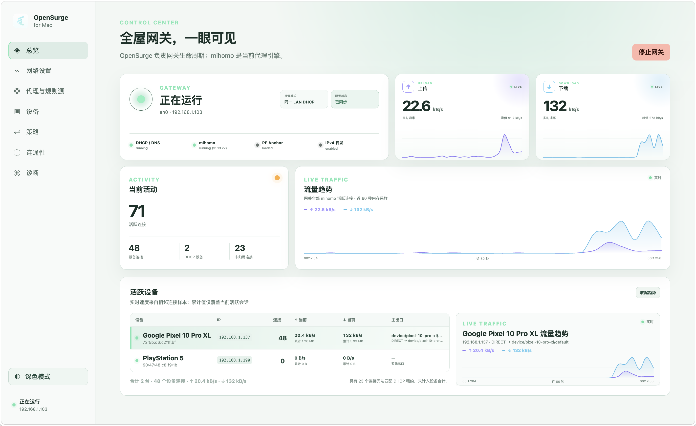
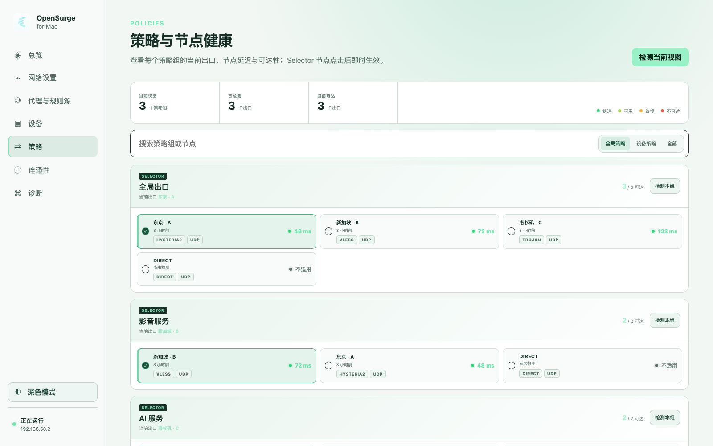
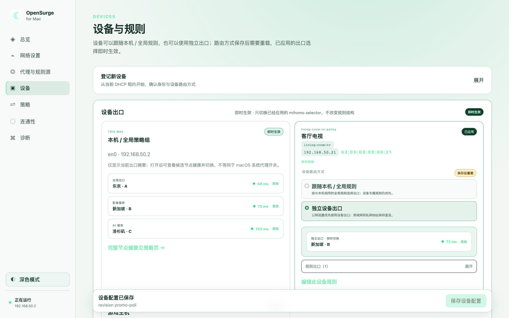

<div align="center">
  
  <h1>OpenSurge for Mac</h1>
  <p><strong>把 Mac 变成可导入规则、可按设备分流的全屋透明代理网关——支持 DHCP/DNS 自动接管</strong></p>
  <p>
    <a href="https://github.com/YTwsy/OpenSurge-for-Mac/releases"></a>
    
    
    <a href="LICENSE"></a>
  </p>
  <p>
    <strong>简体中文</strong> · <a href="README.en.md">English</a>
  </p>
  <p>
    <a href="https://github.com/YTwsy/OpenSurge-for-Mac/releases">下载</a> ·
    <a href="docs/app-user-guide.zh-CN.md">App 指南</a> ·
    <a href="#能力">能力</a> ·
    <a href="#每设备策略">每设备策略</a> ·
    <a href="#web-gui-与菜单栏-app">Web GUI</a> ·
    <a href="#ai-agent-友好工作区">Agent 工作区</a>
  </p>
  <table width="100%">
    <tr>
      <td width="66%" valign="top">
        
      </td>
      <td width="34%" valign="top">
        
        <br>
        
      </td>
    </tr>
  </table>
</div>

OpenSurge for Mac 是一个开源的 Surge 风格 macOS 网关与控制面。它把 Mac 变成
整个局域网的代理出口：同一网络下的手机、电视、PS5、游戏机、VR 设备、虚拟机等终端，
都可以从 Mac 获取 DHCP/DNS，并共享由策略控制的网络连接；你也可以为每台设备
单独配置不同的出口策略：手机走代理、游戏机直连，设备啥都不用配。

- 能导入你现有的 mihomo 订阅，它只接管网关那部分，不抢你的节点和规则。
- 有 Web GUI 和菜单栏 app，哪个设备在跑多少流量、走的哪条出口链，一目了然。

底层由 dnsmasq 提供 DHCP/DNS，mihomo 作为代理引擎，macOS pf 与 IPv4
forwarding 提供原生网关路径。

这个仓库也被有意设计成一个
[AI Agent 友好工作区](#ai-agent-友好工作区)：项目知识与代码一起版本化，高风险
网络行为有可执行的证据门槛，Virtual Lab 与真实设备产生的证据会回流到下一轮工程
循环。

## 能力

**友好的 App 体验**

- 通过 macOS 菜单栏 App 随时查看状态、接收网络恢复提醒并打开本地 Web GUI；再次打开
  `/Applications/OpenSurge.app` 会直接展开与菜单栏图标相同的状态面板；
- 在一个控制面中完成订阅导入、网络设置、设备分流、节点健康、连通性检查与诊断；
- 使用恢复状态机引导局域网 DHCP 接管的启动、客户端验收、停止和网络恢复。

第一次使用请参阅 [OpenSurge for Mac App 使用指南](docs/app-user-guide.zh-CN.md)。

**网关与代理**

- 启停 DHCP/DNS、mihomo、pf NAT 与 IPv4 forwarding，并带 rollback；
- 通过 mihomo `mixed-port` 提供显式代理；
- 通过 mihomo TUN 提供 macOS 透明代理；
- DHCP 接管模式为登记设备生成 MAC 绑定的固定 IPv4 租约；旁路由模式（手工网关）
  使用主路由侧保持稳定的静态 IPv4，两者都可使用独立出口策略。

**可观测性**

- 把活跃会话流量归属到 DHCP 设备或同 LAN 的静态登记/当前观察设备，显示每设备
  连接数、实时上下行速率、累计字节与占主要流量的 mihomo 出口链；
- 集中检测代理节点可达性/延迟，并从健康视图切换已应用的 Selector；
- 通过 applied mihomo mixed-port 路径探测固定真实服务目录，展示三轮中位延迟、
  命中规则与实际出口链；
- 查看与切换策略组、查看 imported proxy/rule provider 状态、查看当前连接；
- 输出文本/JSON 形式的 status / doctor / logs / snapshot，并收集允许局部失败的
  JSON snapshot 供诊断与 UI 使用。

**安全与验证**

- 配置校验、TUN-only 透明代理、rollback 与明确的恢复契约；
- 在接触普通 LAN 前，先用隔离的虚拟 LAN lab 验证高风险网络行为。

## 每设备策略

一个 mihomo 进程可以对已登记的 LAN 设备应用独立策略。DHCP 接管模式会为每台设备
配置 MAC 绑定的固定 IPv4 租约；旁路由模式则使用主路由侧保持稳定的静态
IPv4，并从当前经过 Mac 的流量与 ARP 邻居观察辅助登记。两种模式都会生成每设备的
mihomo selector group 和 `SRC-IP-CIDR` 规则。可选 JSON 策略文件让每台设备要么跟随 Mac/全局规则，要么在
全局规则之前走设备专属 selector；它也支持 `REJECT` 这类设备专属动作，以及按
域名/IP/协议/端口/rule-provider 叠加的规则覆盖。dedicated 模式下，本地/私有目标
保持直连。

OpenSurge 有意不内置家庭模板或第三方规则列表；策略内容由操作者提供，空 starter
文件也是合法配置。JSON 模型、优先级、CLI 命令和验证边界见
[每设备策略覆盖](docs/device-policy.zh-CN.md)。

## Web GUI 与菜单栏 App

通过安装包使用 OpenSurge 时，请从
[OpenSurge for Mac App 使用指南](docs/app-user-guide.zh-CN.md)开始。

本地 Control API、React Web GUI 和只读 SwiftUI 菜单栏 launcher 已进入仓库。开发构建：

```sh
make web-install
make control-build
./bin/opensurge-control --config examples/config.example.yaml
make menubar-build
```

控制服务只监听 `127.0.0.1`，启动时会输出一次性 Web GUI 链接。菜单栏 App 显示
状态、恢复警报并打开 Web GUI，不提供网关 start/stop 或策略切换。它区分“只退出菜单栏
App”和“退出 OpenSurge”：后者只在网关数据面已经停止时退出菜单栏 App 与用户级
Control Service；系统 launchd 托管的 root Helper 保持空闲加载，下次打开无需再次授权。
架构、安全边界与构建说明见 [Web GUI 与菜单栏 App](docs/gui-architecture.zh-CN.md)。
Web GUI 内置 applied 网关策略路径的连通性页面，并提供 Net.Coffee 的独立浏览器本机
检测入口；两者都不会被描述成下游设备 DHCP/DNS/TUN 路径已经验收。

`make gui-installer` 会在取得真实 mihomo、dnsmasq 二进制后构建 macOS 安装包。
Developer ID 签名和 notarization 必须显式提供发布凭据。GitHub 正式发布同时提供文件名中
明确带有 `arm64-unsigned.pkg` 与 `x86_64-unsigned.pkg` 的架构专用构建，但不能把正式
Release 描述成已经签名、已经 notarize 或可被 Gatekeeper 直接放行的安装包。

### 安装 GitHub 未签名正式发布包

当前正式发布同时提供 Apple Silicon 与 Intel Mac 安装包。请从对应 GitHub Release 下载
`arm64-unsigned.pkg`（Apple Silicon）或 `x86_64-unsigned.pkg`（Intel），以及
`SHA256SUMS`。可运行 `shasum -a 256 -c SHA256SUMS` 核对已下载文件，并使用以下命令
验证所选安装包的 GitHub 构建来源：

```sh
gh attestation verify OpenSurge-for-Mac-*-arm64-unsigned.pkg \
  -R YTwsy/OpenSurge-for-Mac
gh attestation verify OpenSurge-for-Mac-*-x86_64-unsigned.pkg \
  -R YTwsy/OpenSurge-for-Mac
```

双击安装包。如果 Gatekeeper 阻止安装，进入**系统设置 → 隐私与安全性**，选择
**仍要打开**并完成身份验证，然后再次打开同一个安装包。不要全局关闭 Gatekeeper，
也不要递归删除 quarantine。使用管理员账户完成 Installer 后，从 `/Applications`
打开 **OpenSurge**。安装过程会启动本地 helper 与 Control Service，但网关
仍保持停止，只有在控制面中明确操作才会启动。

pkg 升级会在同一 LAN DHCP 恢复未完成时拒绝执行。替换 payload 前，preinstall 先停止
用户级 Control Service 与菜单栏 App，再使用当前已安装的 `omg stop` 清理网关，最后
卸载 root helper。升级会保留现有配置、导入源、策略数据和 runtime 历史；只有首次安装
才会用包内示例生成 `config.yaml`。

## 透明代理

macOS 上支持的透明代理路径是 TUN。mihomo `redir-port` 和 PF TCP 重定向被
有意禁用，因为当前 Darwin 构建在运行时报告 redir 不受支持。请保持
`mihomo.redir_port` 和 `pf.redirect_tcp_to` 为 `0`，并通过
`transparent.mode: "tun"` 启用透明代理。

## mihomo profile

OpenSurge for Mac 可以渲染托管的 mihomo 配置，也可以导入已有 mihomo profile。
在 imported 模式下，OpenSurge 仍然接管 LAN 绑定、`allow-lan`、DNS 监听与
fake-IP 网段、TUN、`external-controller` 和 runtime 路径等网关关键字段。导入的
profile 会贡献 `proxies`、`proxy-providers`、`proxy-groups`、`rule-providers`、
`rules`，以及不改变网关边界的 DNS 解析器/过滤字段。保留
`nameserver-policy`、`proxy-server-nameserver`、`fake-ip-filter` 等字段，可以让依赖
专用 DNS 的代理节点域名继续正确解析，同时不允许 profile 替换网关 DNS 监听或
TUN DNS 契约。

```yaml
mihomo:
  profile_mode: "imported"
  profile: "./profiles/home.yaml"
```

相对形式的 `mihomo.profile` 会基于 OpenSurge 配置文件所在目录解析。导入的
`proxy-providers` 和 `rule-providers` 内部如果有相对 `path:`，会基于被导入的
mihomo profile 所在目录解析。OpenSurge 会渲染 `profile.store-selected: true`，
让 mihomo 可以跨重启保存策略组选择。

启动网关服务前，可以先预览最终生成的 mihomo 配置：

```sh
go run ./cmd/omg doctor --config examples/config.imported-profile.example.yaml
go run ./cmd/omg render-mihomo --config examples/config.example.yaml
go run ./cmd/omg render-mihomo --config examples/config.imported-profile.example.yaml
```

当 `mihomo.binary` 指向已安装的 mihomo 二进制时，可以使用
`validate-mihomo`。它会渲染最终配置，并运行 mihomo 自己的 `-t` 校验，但不会
启动网关服务。

```sh
go run ./cmd/omg validate-mihomo --config examples/config.imported-profile.example.yaml
```

## CLI 使用方式

下面的命令适合开发、自动化和诊断。普通安装包用户可以直接使用
[App 使用指南](docs/app-user-guide.zh-CN.md)中的图形界面流程。

### 状态与诊断

```sh
go run ./cmd/omg doctor --config examples/config.example.yaml
go run ./cmd/omg status --config examples/config.example.yaml
go run ./cmd/omg status --config examples/config.example.yaml --format json
go run ./cmd/omg logs --config examples/config.example.yaml --tail 50 --format json
go run ./cmd/omg snapshot --config examples/config.example.yaml --tail 50 --format json
```

### 策略、设备与 Provider

```sh
go run ./cmd/omg policies --config examples/config.imported-profile.example.yaml
go run ./cmd/omg policy-select \
  --config examples/config.imported-profile.example.yaml \
  --group Proxy \
  --policy DIRECT

# 配置 device_policy.file 后：
go run ./cmd/omg devices --config ./config.yaml --format json
go run ./cmd/omg device-policy-select \
  --config ./config.yaml \
  --device alice-phone \
  --slot default \
  --policy DIRECT

go run ./cmd/omg connections \
  --config examples/config.imported-profile.example.yaml \
  --format json
go run ./cmd/omg providers \
  --config examples/config.imported-profile.example.yaml \
  --format json
go run ./cmd/omg provider-update \
  --config examples/config.imported-profile.example.yaml \
  --provider demo-provider \
  --format json
```

### 配置渲染

```sh
go run ./cmd/omg render-mihomo --config examples/config.example.yaml
go run ./cmd/omg validate-mihomo \
  --config examples/config.imported-profile.example.yaml
```

### 网关生命周期

以下操作会修改 DHCP、DNS、PF、IPv4 forwarding 或 mihomo 运行状态，需要 `sudo`：

```sh
sudo go run ./cmd/omg start --config examples/config.example.yaml --format json
sudo go run ./cmd/omg reload --config examples/config.example.yaml --format json
sudo go run ./cmd/omg restart-mihomo --config examples/config.example.yaml --format json
sudo go run ./cmd/omg stop --config examples/config.example.yaml --format json
```

补充说明：

- `policy-select` 会读取 live mihomo 策略组，并在发送切换请求前拒绝未知 group 或
  policy；
- `provider-update --provider <name>` 会请求 mihomo 刷新指定 proxy provider，并返回
  刷新后的 provider 状态；
- `logs --tail N --format json` 会返回最近的 dnsmasq 和 mihomo 日志行，并标出每个
  日志文件的存在状态和读取错误；
- `snapshot --format json` 会聚合 status、doctor、leases、日志、策略组、连接和
  provider 状态；mihomo API 失败不会阻止其余 snapshot 返回；
- `restart-mihomo` 只重启代理核心，不会停止 dnsmasq、卸载 PF、恢复 IPv4 forwarding
  或修改本机网络设置；
- `--format json` 会保留非零失败退出码，并在 stderr 输出结构化错误。成功的 `start`
  和 `stop` 会返回包含 `command`、`ok` 和 `config_path` 的 payload。

## AI Agent 友好工作区

OpenSurge 把仓库本身也视为工程系统的一部分，而不只是存放代码的地方。目标是让
产品意图、网络安全规则、运行时证据与积累下来的项目知识，都能被人类贡献者和
Coding Agent 直接理解和使用。

### Harness Engineering：设计 Agent 周围的工程环境

这个工作区实践了
[Harness Engineering](https://openai.com/index/harness-engineering/) 的核心思想：
Agent 是否可靠，不只取决于模型，还取决于模型周围的上下文、约束、工具、可观测性
与验收门槛。

- `AGENTS.md` 是精简的入口地图：它定义产品身份、硬性网络不变量，并告诉 Agent
  针对不同任务必须继续阅读哪些文档。
- [`docs/agent-wiki/`](docs/agent-wiki/README.md) 以渐进披露的方式提供架构、决策与
  验证上下文，避免每个任务都从全仓库重新拼装心智模型。
- `status`、`doctor`、`logs`、`snapshot` 等机器可读 CLI，加上确定性的 `make`
  入口与保留的 artifacts，让 Agent 能直接观察正在运行的系统。
- 配置校验、只允许 TUN 的透明代理、rollback、隔离 Lab 与明确的恢复契约，把安全
  指引变成可以执行和检查的边界。

### Loop Engineering：用可执行证据闭环

OpenSurge 实践
[Loop Engineering](https://addyosmani.com/blog/loop-engineering/) 的核心：设计一套
能够反复执行、观察、验证、恢复，并把结果带入下一轮的系统，而不是依赖一次写得很
漂亮的 prompt。

```text
目标 + 约束
    ↓
AGENTS.md → Agent Wiki → 事实来源
    ↓
实现 → 快速测试 → Virtual LAN Lab
    ↓
ADB 辅助或人工真实设备验证
    ↓
日志 + artifacts + 清理/恢复证据
    ↓
可复用知识回写 sources/ 与 wiki/
    ↺
```

这些验证层互相补充：

- `make test` 与聚焦的 UI/控制面 gate 构成快速内循环。
- 基于 Lima + socket_vmnet 的 Virtual LAN Lab，把需要权限的 DHCP、DNS、pf/NAT、
  forwarding、TUN、策略、rollback 与清理行为放进可复现的隔离环境，不冒险干扰
  普通 LAN。
- 真实设备与 same-LAN/same-WiFi runner 负责闭合物理拓扑循环。ADB 可以收集
  Android 路由、DNS 与连通性证据，Mac 侧同时关联 dnsmasq/mihomo 日志；当操作者
  需要保留手机侧直接控制时，也支持人工检查点。
- 对 DHCP 接管等高风险流程，恢复本身就是验收的一部分。流量探针成功，但路由器、
  Mac 或客户端无法回到已知正常状态，仍不能算闭环完成。

Virtual Lab 不能替代真实设备行为，一次真机 smoke 也不能替代确定性的 Lab gate。
每个门槛究竟允许支持什么结论，见
[验证契约](docs/agent-wiki/wiki/concepts/validation-gates.md)。

### Agent Wiki：外置的项目记忆

[Agent Wiki](docs/agent-wiki/wiki/index.md) 融入了 LLM Wiki 思想：把可复用的长期记忆
从短暂的上下文窗口移到小型、版本化、带来源的知识层中。

- `docs/agent-wiki/sources/` 保存稳定的项目简报、决策与验证契约。
- `docs/agent-wiki/wiki/` 把来源材料整理成短小、互相链接的页面，让 Agent 按任务
  渐进加载。
- `.codex/hooks.json` 在本机安装 Session Wiki hook 后，把 session 延续与 compaction
  接入项目本地记忆，同时不把私有 session 状态提交到仓库。

这个知识层只收录可复用、已经验证的内容；一次性日志、临时输出、未经验证的猜测和
普通 TODO 不进入 Agent Wiki。

## 许可证

OpenSurge for Mac 自有代码以及未另行声明的资产采用
[GNU General Public License version 3 only](LICENSE)（`GPL-3.0-only`）。随包分发的
第三方程序与库继续保留各自许可证；详见
[第三方声明](THIRD_PARTY_NOTICES.md)，其中包含内置 mihomo、dnsmasq 准确版本的
对应源码链接。

## 安全

`start` 和 `stop` 需要用 `sudo` 运行，因为它们会管理 DHCP、pf 和 IPv4
forwarding。运行时文件会写入配置文件中的 `runtime.dir`。

## 开发流程

把 `make test` 作为快速默认门禁。CI 当前只运行这个单元测试门禁，所以普通
push 和 pull request 不需要主机网络、免密 sudo、Lima 或 socket_vmnet。

在提交或评审高风险网络改动前，请本地运行 `make lab-test`。这包括 DHCP、
DNS、mihomo 启动/配置渲染、pf 规则、forwarding/rollback 行为、网关生命周期、
lab 脚本，以及会影响运行时流量的示例配置。除非有专用 macOS runner 能提供同样
受控的主机权限和网络隔离，否则虚拟 LAN lab 应保持为本地、夜间或手动门禁。

使用 `make lab-test-tun` 验证支持的透明代理路径。该测试会让客户端不配置代理，
并要求 mihomo 日志中出现通过 TUN inbound 观察到的直连 HTTPS 请求。修改
mihomo profile 导入或 overlay 行为时，使用
`make lab-test-tun-imported-profile`；它会用 imported profile fixture 跑同一个
TUN 门禁。修改 imported provider 或会影响透明 TUN 流量的策略选择行为时，使用
`make lab-test-tun-imported-egress`；它会使用本地 HTTP provider 和受控 HTTP
CONNECT proxy，证明 `policy-select` 可以把 TUN 出口路径在 `DIRECT` 与受控代理
之间切换。

修改 MAC 租约、每设备 selector 或设备覆盖的数据路径时，使用
`make lab-test-tun-device-policy`。它会证明两个客户端获得各自的固定租约、可独立
选择不同的 TUN 出口，并验证设备级域名 `REJECT` 生效。域名/协议规则编译、模板和
HTTP/MRS rule-provider 配置由单元测试覆盖；不需要为每条操作者规则运行 Lab。

策略组控制面和机器可读 CLI 改动优先使用 `make policy-control-test`。它会启动真实
mihomo 二进制，但不使用 sudo、dnsmasq、pf 或 TUN，并通过 live external-controller
API 检查 `policies`、`policy-select`、mihomo 重启后的策略选择恢复、通过
mixed-port 进行的本机 DIRECT/代理出口切换，以及 `connections`、`providers`、
针对 file 与 HTTP proxy provider 的 `provider-update` 和 `snapshot`；其中也会验证
未知 policy 会被 `policy-select` 拒绝。

使用 `make same-lan-start-tun` 和 `make same-lan-adb-check` 验证窄范围的同
LAN 默认网关 smoke。这个 gate 会保持 DHCP disabled，要求 TUN，并通过 ADB 检查
一台默认网关和 DNS 指向 Mac LAN IP 的 Android 测试设备。需要先验证单个域名的
真实代理出口时，可以配合 `OMG_SAME_LAN_*` 上游代理环境变量使用
`make same-lan-start-tun-proxy`，例如先测 `api.ipify.org`，再讨论完整订阅导入。
更接近真实设备路径的 imported provider 策略切换 smoke 使用
`make same-lan-start-tun-imported-egress` 和
`make same-lan-adb-check-imported-egress`：它会导入 provider-backed `TunEgress`
group，并把同 LAN TUN 流量从 `DIRECT` 切到受控本地 HTTP CONNECT proxy。这些 gate
不宣称已经具备全 LAN 上线能力或真实远端订阅出口。
如果明确不使用 ADB，也可以通过人工 Android 浏览器探针收集同一 imported egress
证据；见[`tests/same-lan/README.zh-CN.md`](tests/same-lan/README.zh-CN.md#不使用-adb-的手动手机检查)。

对于专门测试 Wi-Fi，路由器 DHCP 已由人工关闭后，可使用
`make same-wifi-dhcp-start-imported-egress`，让 Android 以 DHCP 模式重新加入，再运行
`make same-wifi-dhcp-adb-check-imported-egress`。这个独立高风险 runner 使用
`gateway.mode: "same_wifi_dhcp"`，要求显式提供受保护的静态地址列表和路由器 DHCP
已关闭的操作确认。其 stop gate 会验证 OpenSurge 清理，但路由器 DHCP 与客户端自动
获取仍需人工恢复；详见
[`tests/same-lan/WIFI-DHCP-RUNNER.zh-CN.md`](tests/same-lan/WIFI-DHCP-RUNNER.zh-CN.md)。

## 虚拟 LAN lab

集成 lab 会用两个轻量 Linux 客户端测试真实的 macOS 网关。Lima 提供客户端，
socket_vmnet 创建一个没有竞争 DHCP 服务器的隔离二层主机网络。测试覆盖 DHCP、
DNS、ICMP/NAT、直连 HTTPS，以及通过 mihomo `mixed-port` 的显式 HTTPS。

```sh
make lab-install
make lab-up
sudo -v
make lab-test
make lab-test-tun
make lab-test-tun-imported-profile
make lab-test-tun-imported-egress
make lab-test-tun-device-policy
make lab-down
```

一次性安装器会添加一个 root 拥有、功能固定的网络 helper，并添加一个很窄的
sudoers 规则，只允许启动、停止和查看 lab 网络状态。网关二进制本身不会获得免密
root 权限；端到端测试前请用 `sudo -v` 刷新 sudo ticket。拓扑、安全检查和排障
步骤见 `tests/lab/README.zh-CN.md`。
