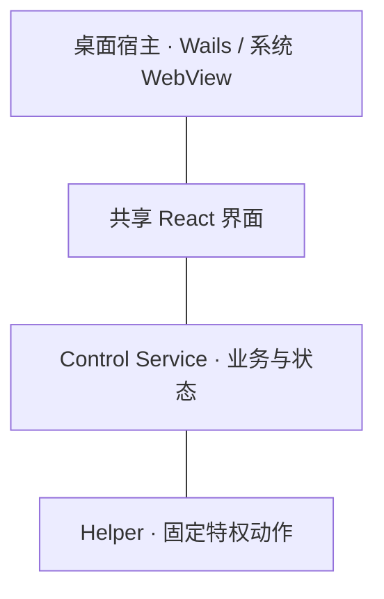

# 桌面宿主

桌面宿主负责 OpenSurge 与 macOS 的交互：窗口、菜单栏、原生能力和桌面会话。
React 界面表达操作意图，Control Service 协调业务，Helper 执行受限的特权动作。

窗口是否可见、桌面 App 是否运行、网关是否运行是不同状态。
原生交互、安装身份和网络能力也各有独立的验证范围。
v0.3 的宿主迁移保留了既有业务与后台服务边界。

- 查询窗口、认证、菜单栏、登录项与退出 → [桌面契约](../../sources/decisions/desktop-host.md)。
- 查询安装与文件归属 → [分发契约](../../sources/distribution.md)。
- 查询原生交互与平台验收 → [desktop smoke](../../sources/validation/desktop-smoke.md) / [安装矩阵](../../sources/validation/evidence-map.md#桌面与安装)。
