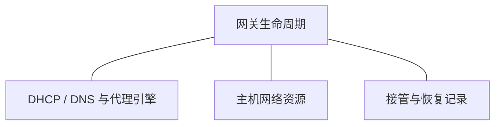

# 网关生命周期

OpenSurge 的网关由地址分配、名称解析、代理转发和主机网络资源共同组成。
生命周期协调这些资源的接管与归还，runtime state 记录本次接管的所有权。

网关停止与家庭网络恢复是两个相关的责任：前者归还 OpenSurge 拥有的资源，后者还涉及
路由器、Mac 和客户端。界面、后台控制服务与网关各有自己的生命周期。

- 查询启停、回滚、重载和进程所有权 → [生命周期契约](../../sources/decisions/gateway-lifecycle.md)。
- 查询 DHCP 接管阶段与恢复责任 → [恢复契约](../../sources/decisions/dhcp-recovery.md)。
- 查询哪些路径已有运行证据 → [验证与证据](validation-gates.md)。
