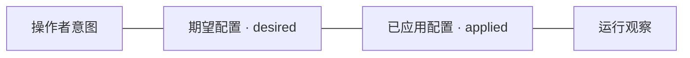

# GUI 控制面

控制面把操作者的意图、已经应用的配置和实际观察到的运行状态联系起来。
桌面主窗口与浏览器共享业务界面，菜单栏提供状态与入口；Control Service 维护共同的业务语义。

保存、应用和观察是不同关系。待应用配置、诊断结果与网关故障各有含义；
设备登记、连接观察和实际访问证据也不能互相替代。

- 查询展示状态、页面职责和交互规则 → [GUI 契约](../../sources/decisions/gui-control-plane.md)。
- 查询认证、配置事务、接口与操作进度 → [Control API](../../sources/control-api.md)。
- 查询连接归属、流量采样和刷新范围 → [连接观察](../../sources/decisions/connection-observation.md)。
- 查询开发运行与构建 → [开发说明](../../sources/development.md)。
