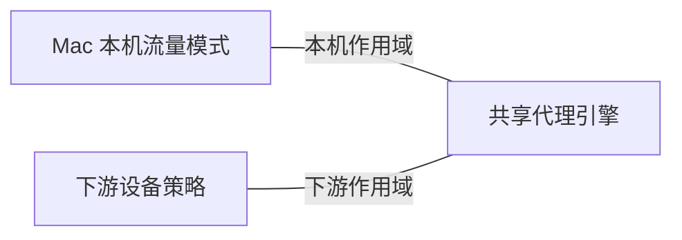

# Mac 本机流量与下游设备

Mac 同时是流量的发起者和下游设备的网关。本机流量模式负责 Mac 自身的路由选择，
设备策略负责下游设备的路由选择。两者共享代理引擎，作用域独立。

系统代理协同负责应用流量如何接入代理，本机流量模式负责接入后的路由选择。
流量属于哪个作用域，由来源身份决定。

- 查询模式语义、精确身份和切换规则 → [本机路由契约](../../sources/decisions/local-mac-routing-modes.md)。
- 查询系统代理设置的接管与恢复 → [系统代理协同](../../sources/decisions/local-system-proxy-coordination.md)。
- 查询本机与下游隔离的证明范围 → [本机模式门槛](../../sources/validation/test-gates.md#Mac-本机模式隔离门槛)。
