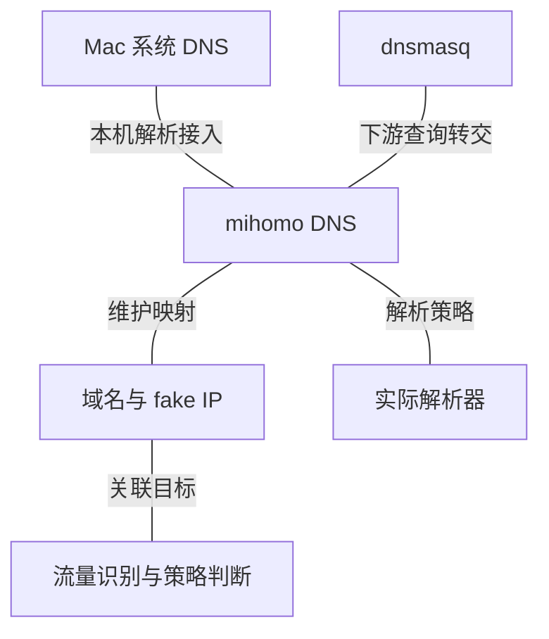

# 系统 DNS、网关解析与 fake IP

OpenSurge 协调两类解析入口：macOS 系统 DNS 面向 Mac 应用，dnsmasq 为使用网关 DNS
的下游设备提供入口。mihomo DNS 承担代理侧的解析策略与域名映射；默认配置将 dnsmasq
的上游连接到它，本机解析则通过系统 DNS 协同与 TUN 捕获接入。

fake IP 是域名在代理数据面中的虚拟目的地址。引擎维护域名与虚拟地址的对应关系，
使后续连接仍能关联域名并参与策略判断。实际出站所需的解析由相应解析策略与出口负责。

图中表示职责关联。DNS 查询和后续业务连接是不同的流量，fake IP 映射需要与 TUN 等
接入路径配合；取得 DNS 答案、连接进入引擎、实际出口可用分别需要对应证据。
fake IP 表达目标域名，客户端来源身份决定本机或下游设备的策略作用域。

系统 DNS 协同具有临时所有权与恢复边界；局域网私有名称和应用自己的解析通道也有各自
的处理范围。AAAA 答案、Mac 本机 IPv6 路由与下游 IPv6 接管仍是三个不同问题。

- 查询系统 DNS 所有权、私有解析和 host TUN 路由 → [DNS 契约](../../sources/decisions/local-system-dns-coordination.md)。
- 查询 dnsmasq 与代理引擎的服务职责 → [网关生命周期](../../sources/decisions/gateway-lifecycle.md)。
- 查询解析策略、fake IP 过滤与映射持久化 → [profile overlay 契约](../../sources/decisions/mihomo-profile-overlay.md)。
- 查询本机来源身份与下游隔离 → [本机路由契约](../../sources/decisions/local-mac-routing-modes.md)。
- 查询系统解析、重启与恢复证据要求 → [本机模式门槛](../../sources/validation/test-gates.md#Mac-本机模式隔离门槛)。
