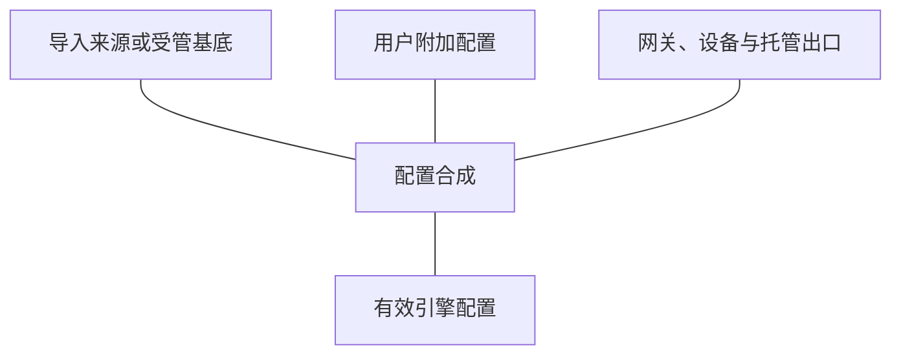

# 配置来源与网关合成

OpenSurge 将代理与规则内容、用户附加配置和网关自身职责组合为引擎配置。
导入来源提供可复用内容，网关仍拥有网络接管与控制接口的配置边界。

原始来源、草稿、准备态与运行态有各自的生命周期。
准备态用于观察和选择未来的策略；网络是否已接管由网关运行态表达。

- 查询导入、DNS 合并、保留字段与准备态 → [profile overlay 契约](../../sources/decisions/mihomo-profile-overlay.md)。
- 查询来源存储与显式应用 → [Control API](../../sources/control-api.md#来源凭据与应用)。
- 查询合成与实际接管的验证 → [策略控制](../../sources/validation/test-gates.md#策略控制面门槛) / [TUN 门槛](../../sources/validation/test-gates.md#透明代理门槛)。
