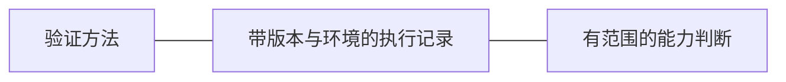

# 验证与证据

验证方法回答怎样检查、什么算通过；执行记录回答哪个版本在什么环境实际发生了什么。
能力判断需要把实现、路径和证据关联起来。

代码、真实引擎、虚拟 LAN、物理客户端与原生桌面各自覆盖不同边界。
构建、配置被接受、流量成功与完整恢复也分别提供不同层面的证据。

- 选择命令、通过标准与允许结论 → [验证门槛](../../sources/validation/test-gates.md)。
- 准备 Lab 或区分环境故障 → [Lab 运行](../../sources/validation/lab-gates.md)。
- 判断已有结果能否沿用 → [证据入口](../../sources/validation/evidence-map.md)。
- 验证原生交互或安装 → [desktop smoke](../../sources/validation/desktop-smoke.md) / [安装矩阵](../../sources/validation/evidence-map.md#桌面与安装)。
