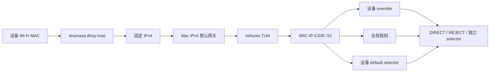

# 每设备策略在 same-WiFi DHCP 拓扑下的代码审阅与修复方案

审阅日期：2026-07-11  
审阅基线：`bde453f feat: add per-device policy overlays`  
目标拓扑：路由器关闭 DHCP，OpenSurge 在 Mac 的同一 Wi-Fi 接口上提供 DHCP/DNS，
Android 等客户端通过 Mac 的 IPv4 默认网关进入 mihomo TUN。

## 结论

当前实现已经具备可工作的核心数据链：dnsmasq 能按 MAC 分配固定 IPv4，mihomo 能在
一个进程中生成独立 selector，并以 `SRC-IP-CIDR` 区分设备。现有 Virtual LAN 证据也
证明了两个客户端的固定租约、独立 TCP/TUN 出口切换和设备级域名 `REJECT`。

但是，**当前版本不能宣称“每设备策略已在 same-WiFi DHCP 真机拓扑下正常工作并完成
验收”**。准确结论是：

- 对遵守 DHCP 配置、使用稳定 Wi-Fi MAC、只走 IPv4、默认网关和 DNS 均指向 Mac 的
  合作式客户端，固定租约和基于源 IPv4 的 TCP 设备策略有充分理由正常工作；
- 当前 same-WiFi runner 没有加载 `device_policy.file`，也没有验证 MAC、固定地址、
  设备 selector 或任一设备规则，因此 2026-07-11 的真机记录不能证明最新功能；
- 域名/IP/协议/端口组合、HTTP/MRS rule-provider 目前主要是编译与 mihomo 配置校验
  证据，没有 same-WiFi 真机数据面证据；
- same-WiFi 拓扑本身不是强制安全边界。客户端仍与原路由器处于同一二层网络，改用
  路由器 IPv4 网关、路由器 DNS，或继续使用路由器 IPv6 RA，都可能绕过 Mac；
- 在修复 P0/P1 项并完成新的真机 gate 前，本功能应标记为
  `experimental / cooperative IPv4 policy`，不能用于“不可绕过”的家长控制或零信任隔离。

## 当前实现链路

代码对应关系：

- `internal/dhcp/template.go` 把 reservation 渲染为
  `dhcp-host=<mac>,<ipv4>`；
- `internal/device/policy.go` 生成 `device/<id>/<slot>`、设备 override 和
  `SRC-IP-CIDR,<ipv4>/32` 默认规则；
- `internal/mihomo/device_policy.go` 把设备 override 放在全局规则之前，把设备默认规则
  放在全局规则之后、terminal `MATCH` 之前；
- `internal/mihomo/manager.go` 在启动 mihomo 前实际执行 `mihomo -t`；
- `internal/config/validator.go` 要求 `same_wifi_dhcp` 同接口、启用 DHCP 和 TUN，并限制
  DHCP range 位于 Mac 所在 `/24`。

这条链路在设计上可以保留转发客户端的源 IPv4。已有 same-WiFi 日志中能看到
`192.168.1.141 --> ...`，Virtual LAN 的设备规则日志也能看到
`192.168.50.102 --> example.com:443 ... using REJECT`。

## 审阅和验证证据

本次审阅实际执行：

- `PATH=/opt/homebrew/bin:$PATH GOCACHE=/private/tmp/open-surge-review-go-cache make test`：通过；
- `PATH=/opt/homebrew/bin:$PATH GOCACHE=/private/tmp/open-surge-review-go-cache go vet ./...`：通过；
- `bash -n tests/lab/lab.sh tests/same-lan/smoke.sh tests/real-device/smoke.sh`：通过；
- `git diff --check`：通过；
- 用真实 `mihomo v1.19.27` 校验一个同时含 domain、目标 IP CIDR、TCP、目标端口和
  inline rule-provider 的生成配置：通过；
- 用真实 mihomo 构造 imported group 与 `device/phone/default` 同名：
  `duplicate group name`，验证了当前缺少命名空间预检；
- `dnsmasq 2.93 --test` 校验现有 device-policy Lab 配置：通过；
- `make lab-status`：Lab 当前处于 stopped，两个 Lima 客户端也已停止。

本次没有执行：

- 没有重新运行 `make lab-test-tun-device-policy`，因为当前 shell 没有可用的缓存 sudo
  ticket；
- 没有重新改变路由器 DHCP 或启动 same-WiFi 高风险 runner；
- 没有宣称 HTTP/MRS、UDP/QUIC、IPv6 或多真机兼容性已完成数据面验证。

仓库内 `artifacts/lab/20260711-020540/` 和 `runtime/lab/` 保留了最近一次 device-policy
Lab 的结果：`.101/.102` 固定租约、两个独立 selector 的最终选中状态，以及设备 2 的
域名 `REJECT` 日志。该 artifact 的最终阶段会覆盖前一阶段日志，因此不应把它当作
协议/端口/provider 或 same-WiFi 的完整证据。

## 漏洞与风险清单

### P0-1：same-WiFi 拓扑允许绕过 Mac

同一 Wi-Fi 中，原路由器仍位于客户端可直接访问的二层网络。关闭路由器 DHCP 只停止
地址分配，并不会让路由器的 IPv4 网关、DNS 或 IPv6 Router Advertisement 消失。

影响：

- 客户端手动把 IPv4 gateway 改回路由器即可绕过 OpenSurge；
- 客户端查询路由器 LAN IP 上的 DNS 时，由于 TUN 排除了整个 LAN `/24`，查询不进入
  mihomo DNS；
- 路由器继续发送 IPv6 RA 时，客户端可能自动获得 IPv6 默认路由并绕过仅支持 IPv4
  `SRC-IP-CIDR` 的设备策略；
- 同一二层网络的客户端还可以静态占用另一台设备的 reserved IPv4。MAC reservation
  与源 IP 规则不是身份认证或防伪造机制。

修复方案：

1. 产品和文档明确区分两种模式：
   - `same_wifi_dhcp`：合作式 IPv4 策略与验证模式；
   - 独立下游 AP/VLAN：可作为强制网关的生产拓扑。
2. 如果目标是不可绕过策略，使用独立 SSID/VLAN/物理下游接口，使客户端只能到达 Mac，
   或在上游 AP/路由器配置 ACL，阻止该 SSID 客户端直接访问路由器网关。
3. same-WiFi gate 启动前检查 Android 的 IPv4 与 IPv6 默认路由；发现非 Mac IPv4
   default route 或任意可用 IPv6 default route 时失败。
4. 测试 SSID 上显式关闭 IPv6 RA/DHCPv6，或把 IPv6 设备身份与转发支持作为独立项目，
   不得用 `dns.ipv6: false` 代替 LAN IPv6 隔离。

验收标准：

- same-WiFi 报告必须写明“合作式 IPv4”，并展示 Android 无 IPv6 default route；
- production/强制模式必须证明客户端无法直接经原路由器 IPv4/IPv6 出网。

### P0-2：same-WiFi runner 没有接入每设备策略

`tests/same-lan/smoke.sh` 的 `write_config` 没有输出 `device_policy.file`。当前 ADB gate
只要求 Android 地址落在动态 range 内，并在 lease/DHCPACK 中出现；它没有检查：

- Android 当前 Wi-Fi MAC 是否等于登记 MAC；
- 获得的 IPv4 是否等于登记的 reserved IPv4；
- `omg devices` 是否把该设备标为 lease 匹配；
- live mihomo 是否存在 `device/<id>/default` 和规则 selector；
- 真机请求是否以该 reserved IPv4 命中设备规则；
- 第二台设备是否不受第一台设备 selector 切换影响。

此外，当前 gate 的 `assert_wifi_dhcp_lease` 强制被测地址必须在动态池内。dnsmasq 官方
语义允许 `dhcp-host` 地址位于动态池外，只要求它与某个有效 `dhcp-range` 同子网；因此
这个断言会错误拒绝常见的“动态池 `.120-.199`、设备 reservation `.101`”配置。

修复方案：

1. 增加独立入口，而不是改变现有 imported-egress gate：
   - `make same-wifi-dhcp-start-device-policy`；
   - `make same-wifi-dhcp-adb-check-device-policy`；
   - 可选 `make same-wifi-dhcp-adb-check-device-policy-two-clients`。
2. 新增环境参数：
   - `OMG_SAME_WIFI_DHCP_DEVICE_POLICY_FILE`；
   - `OMG_SAME_WIFI_DHCP_DEVICE_ID`；
   - `OMG_SAME_WIFI_DHCP_EXPECTED_MAC`；
   - `OMG_SAME_WIFI_DHCP_EXPECTED_IPV4`；
   - 第二设备对应参数。
3. runner 把 policy 文件复制为 runtime snapshot，再在配置中引用 snapshot，避免测试中
   原文件被编辑。
4. ADB 从 `ip link show wlan0` 读取当前 SSID 使用的 MAC；不要使用包装盒/系统“设备
   MAC”字段。Android 的 per-network randomized MAC 通常可稳定使用，但必须以实际值
   登记并在每次 gate 中比较。
5. lease 验证改为精确的 `(MAC, IPv4)` 二元组匹配；reserved IPv4 可以在动态池内或
   池外，但必须位于同一 `/24` 且不与保护地址冲突。
6. 日志 gate 同时匹配源 IPv4、目标、规则和 selector，不能只匹配
   `--> <host>:443`。现有 same-WiFi imported gate也应补源 IP 条件，避免 Mac 自身同域名
   流量造成假阳性。

验收标准：

- Android DHCP renew 后得到精确 reserved IPv4；
- `omg devices --format json` 返回 `lease_match: true`；
- mihomo 日志包含
  `<reserved-ip>:<port> --> <target> ... using device/<id>/<slot>[<policy>]`；
- 切换设备 A 后，设备 B 的选中项和出口证据保持不变；
- stop 后完成 OpenSurge 清理，再单独完成路由器 DHCP/客户端恢复 gate。

### P1-1：`devices` 可能把错误 IP 的租约报告为 online

`cmd/omg/main.go` 的 `configuredDevices` 先按 MAC 建表，再只要 MAC 存在就复制
hostname 和 `Online`，没有核对 lease IP 是否等于策略中的 reserved IPv4。

典型场景：

- policy 把设备从 `.141` 改成 `.101`，但设备尚未 renew；
- policy 文件运行中被修改，而 dnsmasq 仍使用旧配置；
- 随机 MAC 或旧 lease 造成地址漂移。

此时 CLI 会显示设备 online，但 mihomo 只匹配新的 `.101/32`，实际流量可能落入全局
规则或 `MATCH`。

修复方案：

- 设备状态返回 `lease_mac_match`、`lease_ip`、`expected_ip`、`lease_match`、
  `lease_expires_at`；
- 只有 MAC 和 IP 同时相等且 lease 未过期时，才报告 `policy_identity_ready: true`；
- 把当前 `online` 改名为 `lease_active`，或明确它只表示租约未过期，不代表设备可达；
- same-WiFi start 后等待精确 lease identity ready，否则不进入策略测试。

### P1-2：policy 文件存在 desired/applied 分裂和启动期多次读取

policy 文件在 `config.Load` 验证、mihomo 渲染、dnsmasq 渲染和 mihomo `Start` 中被多次
读取。网关运行后，`devices` 与 `device-policy-select` 又直接读取磁盘上的最新文件，
而正在运行的 dnsmasq/mihomo 仍使用旧配置。

影响：

- 启动时若文件恰好变化，DHCP reservation 与 `SRC-IP-CIDR` 规则可能来自不同版本；
- 运行中编辑文件后，`devices` 展示的是 desired 状态而不是 applied 状态；
- CLI 可能操作一个未部署的 group，或对复用同名 group 的新语义给出误导结果。

修复方案：

1. `config.Load` 后只加载/校验/编译 policy 一次，形成 immutable
   `CompiledPolicyBundle`。
2. bundle 包含 canonical JSON、SHA-256、reservations、mihomo sections 和设备索引；
   dnsmasq 与 mihomo 从同一个 bundle 渲染。
3. 启动前把 bundle 原子写入 `runtime/device-policy.applied.json`，并把 digest 写入
   `state.json`。
4. `devices` 默认读取 applied snapshot，同时返回当前 desired digest 与
   `drift: true/false`。
5. MVP 阶段明确要求修改 policy 后 stop/start；后续再实现事务式 reload：先生成并
   `mihomo -t`，再切换 mihomo/dnsmasq，任何一步失败则保留旧 bundle。

### P1-3：reserved IPv4 没有与真实 LAN 保护地址做统一冲突检查

`ValidatePolicySetForLAN` 目前只检查同 `/24`、非 `.0/.255`、非 Mac gateway 和设备间
唯一。它不知道 same-WiFi runner 的 protected IP、路由器地址、recovery device、LAN
代理、现存 ARP 邻居或旧 DHCP lease。

影响：固定地址可能与路由器、静态代理、恢复设备或另一 DHCP 服务器遗留地址冲突。

修复方案：

- 将 `protected_ipv4` 从仅 runner 环境变量提升为正式 gateway 配置或 start-time
  validation input；
- 验证所有 reservation 与 gateway、router、protected addresses、动态池策略之间的
  关系；reservation 在动态池内是允许的，dnsmasq 会保留它，但必须显式记录；
- 启动前对每个 reserved IPv4 做 ARP/ICMP 冲突探测。若地址已有不同 MAC 响应则失败；
- 清理或隔离 stale lease file，并要求目标设备重新关联/renew；
- 抓取 DHCP OFFER/ACK 的 server identifier，确认没有第二个 DHCP server。当前
  `...ROUTER_DHCP_DISABLED=confirmed` 只是人工收据，不能作为唯一运行证据。

### P1-4：UDP/QUIC 可能在 selected outbound 不支持 UDP 时向下继续匹配

mihomo 官方规则语义说明：UDP 请求命中一个不支持 UDP 的代理节点时，会继续匹配后续
规则。当前 device default 和 selector rule 后面仍有全局规则或 terminal `MATCH`。

因此当设备 selector 选中 HTTP 代理等无 UDP 能力的 outbound 时，UDP/QUIC 可能继续
落到 `MATCH,DIRECT`。这会破坏“设备默认出口”和“UDP 覆盖”的直觉语义。现有 Lab 只用
HTTPS/TCP，没有覆盖此路径；现有 same-WiFi 日志也能看到 UDP/443 与 UDP/123 走全局
`MATCH,DIRECT`，但该次运行尚未加载 device policy。

修复方案：

1. 在 schema 中定义明确的 unsupported-outbound 语义，例如：
   `on_unsupported: reject | fallthrough`，设备策略默认建议 `reject`。
2. fail-closed 编译方式：selector 规则后紧跟同条件 `REJECT` fallback；设备 default
   selector 后紧跟同源设备 `REJECT` fallback。首条规则可用时正常命中，不支持 UDP
   而继续匹配时由 fallback 阻断。
3. 对静态 proxies 检查 UDP capability；provider 节点则通过 live API/测试流量验证，
   不把“group 名存在”当作 UDP 可用证明。
4. 增加 UDP 数据面 gate：DNS 以外的受控 UDP echo、QUIC/UDP 443、UDP `REJECT`、
   无 UDP outbound 的 fail-closed 四种情况。

### P1-5：generated namespace 和 imported profile 没有预先做冲突/引用校验

OpenSurge 直接把生成的 group/provider 追加到 imported YAML：

- group：`device/<id>/<slot>`；
- provider：`open-surge-ruleset-<id>`。

如果 imported profile 已存在同名对象，`render-mihomo` 仍成功；真实 `mihomo -t` 才报
`duplicate group name`。策略候选和 `action` 引用的全局 group/proxy 也没有在编译阶段
确认存在。

启动最终会执行 `mihomo -t` 并 rollback，因此不是静默启动，但错误发现太晚，`doctor`
的“mihomo config render”也可能显示 OK。

修复方案：

- 用 YAML AST 解析 imported profile，建立 proxy、group、provider 名字集合；
- 编译前拒绝 generated/imported 重名、provider 重名和保留前缀占用；
- 验证每个 `default_policies`、rule `policies`、rule `action` 的引用；允许的 built-in
  policy 使用显式白名单；
- `doctor` 直接运行与 `start` 相同的 `mihomo -t`，并把 collision/reference 错误作为
  preflight failure；
- 增加 group/provider collision、unknown policy、unknown action 测试。

### P2-1：域名策略依赖受控 DNS，DoH/Private DNS 与 LAN DNS 可绕过域名识别

当前 mihomo 日志明确显示 `Sniffer is closed`。域名规则主要依赖客户端使用 Mac DNS
得到 fake-IP。客户端若使用 DoH/Private DNS，或直接查询同网段路由器 DNS，目标业务
域名可能不再以预期方式进入 domain rule。

修复方案：

- same-WiFi gate 检查 Android Private DNS、显式 proxy 和 IPv4/IPv6 DNS 状态；
- 对强制策略拓扑阻止客户端直达路由器/外部 DNS；
- 评估启用 mihomo sniffer，但不要把 sniffer 当作所有 ECH/QUIC/DoH 的完整答案；
- 域名策略 gate 同时包含系统 DNS 正例、Private DNS/DoH 负例或预期阻断行为；
- 文档明确 `ip_cidrs` 是目标 IP，`ports` 是目标端口，避免被理解为源地址/源端口。

### P2-2：rule token 与 inline provider payload 校验过宽

`validPolicy` 只拒绝逗号、制表和换行，仍允许 `#` 等会改变 YAML 标量语义的字符；
inline domain/ipcidr/classical payload 也没有按 behavior 验证内容。最终 `mihomo -t` 能
发现一部分错误，但错误信息晚且不一定能表达操作者原意。

修复方案：

- action/reference 使用结构化 YAML 序列化，不拼接裸 rule string；
- 将 built-in action 与 named outbound 分为不同字段或 tagged union；
- inline `domain` payload 校验 Clash domain wildcard；`ipcidr` 用 `net.ParseCIDR`；
  `classical` 使用 mihomo parser/`mihomo -t` fixture 校验；
- 限制控制字符、注释符和逻辑规则保留字符，提供带 JSON path 的错误位置；
- 为 HTTP provider 增加可选的 digest/size limit/header/proxy，并在状态中显示最后更新、
  rule count 和错误。

### P2-3：当前证据采集容易丢失阶段信息

device-policy Lab 在切换 selector 后重启 gateway 测 `REJECT`，mihomo/dnsmasq log 会被
重新截断，最终 artifact 主要保留最后阶段。same-WiFi imported gate 的策略日志匹配也
没有绑定 Android 源 IP。

修复方案：

- 每个阶段写独立日志快照：`01-reservation`、`02-device-a-proxy`、
  `03-independent-switch`、`04-domain-reject`、`05-udp-port-provider`；
- 每个探针使用唯一 hostname/token，避免背景 `example.com` 流量；
- JSON evidence 记录 source IP、destination、network、matched rule、chain、selector
  与 proxy-side observation；
- gate 最后生成 machine-readable manifest，只有全部断言成功才写 `passed: true`。

## 推荐修复顺序

### 第一阶段：修正声明与身份状态

预计改动：小到中。

1. 文档标记 same-WiFi 为 cooperative IPv4，不宣称防绕过。
2. 修复 `devices` 的 MAC+IP 精确匹配和 `lease_active` 命名。
3. 增加 applied policy snapshot/digest；运行中检测 drift。
4. 增加 namespace/reference 预检，并让 `doctor` 执行真实 `mihomo -t`。

完成门槛：`make test`、`go vet ./...`、collision/unknown reference 单元测试、真实
`validate-mihomo`。

### 第二阶段：建立 same-WiFi 每设备真机 gate

预计改动：中。

1. 新增 device-policy 专用 start/ADB/stop targets。
2. 把 Android 当前 Wi-Fi MAC 和 expected reserved IPv4 纳入 gate。
3. 检查第二 DHCP server、IPv6 default route、Private DNS 和显式 proxy。
4. 用两台真机或“一台真机 + 一台稳定 VM/客户端”证明 selector 相互独立。
5. 保存分阶段 artifact manifest。

完成门槛：真实 dedicated SSID，路由器 DHCP 已人工关闭且抓包未发现第二 OFFER；固定
租约、DNS、源 IP、TUN、selector、proxy log、停止清理均通过。恢复路由器 DHCP 和
客户端自动联网作为单独必需步骤。

### 第三阶段：补齐规则类型和 provider 数据面

预计改动：中到大。

按以下最小矩阵验证，不能只依赖“配置可通过 `mihomo -t`”：

| 能力 | 正例 | 负例/隔离证明 |
| --- | --- | --- |
| domain | 设备 A 命中唯一测试域名 | 设备 B 同域名不命中 |
| target IP CIDR | 访问受控目标 IP 命中 | 邻接 CIDR 不命中 |
| TCP/UDP | TCP 与 UDP echo 分别命中 | 协议不符时不命中 |
| target port | 443 命中 | 同 host 的另一端口不命中 |
| inline provider | rule count 和流量命中 | 未列入条目不命中 |
| HTTP YAML/text | 本地 provider 下载、更新、命中 | 失效 provider 的预期行为 |
| HTTP MRS | 用当前 mihomo 生成 fixture 后下载、命中 | behavior/format 不匹配被拒绝 |
| template reuse | 两个 profile 继承相同片段 | profile override 不污染另一 profile |
| UDP unsupported | 支持 UDP 的节点正常 | HTTP 节点按配置 fail-closed |

完成门槛：Virtual LAN gate 和 same-WiFi 真机 gate 至少各覆盖一次组合规则；HTTP/MRS
必须有 provider 状态、rule count、实际命中和未命中证据。

### 第四阶段：生产强制拓扑

如果产品目标包含家长控制、IoT 隔离或不可绕过的每设备策略，应把独立下游 AP/VLAN
列为正式支持拓扑。验收不再只是“客户端 DHCP 指向 Mac”，而是证明客户端无法直接访问
上游网关，IPv4/IPv6、DNS 和旁路均受控。

## 修复后的总验收门槛

必须全部通过后，才能把结论升级为“same-WiFi 每设备策略已验证”：

1. `make test` 和 `go vet ./...`；
2. `make lab-test-tun-device-policy`；
3. 新的 same-WiFi device-policy ADB gate；
4. 两个设备固定租约与独立 selector；
5. domain、目标 IP、TCP、UDP、目标端口至少各一个真实数据面断言；
6. inline、HTTP YAML/text、HTTP MRS provider 的下载/状态/命中证据；
7. policy drift、MAC 变化、IP 冲突、第二 DHCP server、group/provider collision 均能
   fail fast；
8. 无 IPv6 alternate default route，或 IPv6 已进入同等级策略；
9. stop 清理和路由器 DHCP/客户端自动联网恢复均完成；
10. 报告明确是 cooperative same-WiFi 还是 isolated/VLAN 强制拓扑。

## 参考

- mihomo 官方路由规则文档：<https://wiki.metacubex.one/en/config/rules/>
- mihomo 官方 rule-provider 文档：<https://wiki.metacubex.one/en/config/rule-providers/>
- dnsmasq 官方 man page：<https://thekelleys.org.uk/dnsmasq/docs/dnsmasq-man.html>
- 项目每设备策略说明：`docs/device-policy.zh-CN.md`
- same-WiFi runner：`tests/same-lan/WIFI-DHCP-RUNNER.zh-CN.md`
- same-WiFi 恢复参考：`tests/same-lan/WIFI-DHCP-RECOVERY.zh-CN.md`
- 验证门槛：`docs/agent-wiki/wiki/concepts/validation-gates.md`
