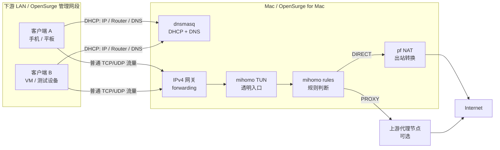
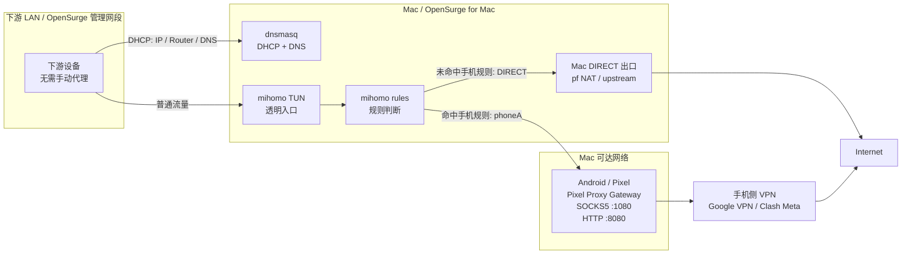

# OpenSurge for Mac 使用方式与结构图

本文描述 OpenSurge for Mac 当前最重要的两种使用方式：

1. Mac 作为常规 LAN 透明代理网关：`mihomo` 规则 + TUN 透明代理 + DHCP/DNS。
2. Mac 作为规则分流节点，并把命中规则的流量转交给运行 Pixel Proxy Gateway 的手机出口。

第一种是 OpenSurge 的基础网关形态。第二种可以理解为在第一种之上，把 Android
手机暴露的 HTTP/SOCKS 代理端口作为 `mihomo` 的一个上游出口。

## 方式一：常规 LAN 透明代理网关

这种方式里，Mac 是下游 LAN 的网关。手机、平板、虚拟机或测试设备不需要手动设置
代理，只要从 OpenSurge 管理的 DHCP 获得 IP、默认网关和 DNS，就可以让流量进入
Mac，再由 `mihomo` 按规则决定直连或走上游代理。



### 流量路径

1. 下游设备通过 DHCP 获取地址，默认网关和 DNS 指向 Mac。
2. 下游设备不需要配置系统代理，也不需要安装客户端。
3. 流量到达 Mac 后，通过 `mihomo` TUN 进入规则引擎。
4. `mihomo` 根据域名、IP、GeoIP、规则集等条件决定走 `DIRECT` 或代理出口。
5. `DIRECT` 流量通过 Mac 上游接口出站；需要普通 NAT 时由 `pf` 处理。

### 适用场景

- 给不方便安装代理客户端的设备提供透明代理能力。
- 给测试机、虚拟机、IoT 设备、平板或备用手机提供统一网络策略。
- 在隔离 LAN 里验证 DHCP、DNS、TUN、NAT 和规则行为。
- 需要集中记录、诊断和回滚网关状态。

### 关键边界

- macOS 上当前支持的透明代理路径是 `mihomo` TUN，不是 `redir-port`，也不是 PF TCP
  重定向。
- DHCP 应只运行在明确的下游接口或隔离测试网段，避免和家庭主路由的 DHCP 冲突。
- Mac 的下游接口和上游接口应当分离；同一个接口同时做下游和上游容易造成路由混乱。
- 真正的出口身份需要用公网 IP 或业务侧验证确认，单纯的 HTTP 204 健康检查只能说明
  请求通了。

## 方式二：规则命中流量走 Pixel Proxy Gateway

这种方式里，OpenSurge 仍然是 LAN 网关和规则分流节点，但某些规则命中的流量不直接
从 Mac 出口走，而是交给一台运行 Pixel Proxy Gateway 的 Android 手机。手机侧可以
继续运行 Google VPN、Clash Meta 或其他 Android 系统 VPN；Pixel Proxy Gateway 只
负责把手机应用层的 HTTP/SOCKS 代理端口暴露给 LAN。



### 流量路径

1. 下游设备仍然把 Mac 当作默认网关。
2. `mihomo` TUN 捕获流量并进入规则判断。
3. 命中指定规则的流量被转给 `phoneA` 这个上游代理。
4. `phoneA` 指向 Pixel Proxy Gateway，例如 `socks5://<pixel-ip>:1080` 或
   `http://<pixel-ip>:8080`。
5. Pixel Proxy Gateway 在手机应用进程里发起出站连接，手机侧系统 VPN 决定最终出口。
6. 未命中手机规则的流量继续走 Mac 的普通 `DIRECT` 出口。

### 推荐拓扑

推荐让 Pixel 手机位于 Mac 可达、但不依赖 OpenSurge 作为默认网关的网络上，例如：

- Pixel 连接 Mac 的上游 Wi-Fi，Mac 可以访问 `pixel-ip:1080`。
- Pixel 在独立旁路 Wi-Fi 或 USB/热点侧网络，Mac 有明确路由可达。
- Pixel 使用固定 IP 或 DHCP 保留地址，避免 `mihomo` 上游配置漂移。

如果 Pixel 本身也接入 OpenSurge 管理的下游 LAN，需要额外小心路由环路。至少应确保：

- `<pixel-ip>/32` 永远 `DIRECT`。
- 私网地址段保持 `DIRECT`。
- 如果手机侧 VPN 的远端服务器地址已知，也应保持 `DIRECT`。
- 最好支持按源地址绕过 Pixel 自己的流量，例如让 `SRC-IP-CIDR,<pixel-ip>/32`
  直接出站。

### 配置草案

OpenSurge 后续可以把手机出口做成一等配置，再渲染到 `mihomo` 的 `proxies` 和
`rules`。示例草案如下：

```yaml
upstreams:
  - name: "phoneA"
    type: "socks5"
    server: "192.168.50.23"
    port: 1080
    udp: true

routing:
  rules:
    - "IP-CIDR,192.168.0.0/16,DIRECT,no-resolve"
    - "DOMAIN-SUFFIX,openai.com,phoneA"
    - "DOMAIN-SUFFIX,anthropic.com,phoneA"
    - "GEOIP,CN,DIRECT"
    - "MATCH,DIRECT"
```

这里的重点是：OpenSurge 不需要在 PF 层把 TCP 包重定向到手机端口。更清晰的模型是
让 `mihomo` 把手机端口作为上游代理 outbound，并由规则决定哪些连接使用它。

### 适用场景

- 想把 Pixel / Android 手机的 Google VPN 出口共享给整个 LAN。
- 只希望 AI、海外服务或特定域名走手机出口，其他流量仍由 Mac 直连。
- 需要把手机出口纳入统一规则、日志、健康检查和回滚流程。
- 希望替代“每台设备手动配置手机代理”的方式。

### 关键边界

- 手机出口是应用层 HTTP/SOCKS 代理，不是二层桥接，也不是手机把整个 LAN 变成 VPN。
- 如果使用 HTTP 代理，通常适合 TCP 和 HTTP CONNECT；如果需要更完整的域名解析和
  UDP 支持，优先验证 SOCKS5。
- UDP、QUIC、游戏、实时音视频、系统 DNS 等路径必须单独验证，不能只靠网页打开成功
  来判断。
- 手机侧 VPN 的可用性、出口 IP 和账号状态由手机系统与 VPN 服务决定，不由
  OpenSurge 直接保证。

## 两种方式对比

| 项目 | 方式一：常规 LAN 网关 | 方式二：规则走 Pixel 出口 |
| --- | --- | --- |
| OpenSurge 角色 | DHCP/DNS/网关/规则引擎 | DHCP/DNS/网关/规则引擎 |
| 下游设备配置 | 无需手动代理 | 无需手动代理 |
| 透明入口 | `mihomo` TUN | `mihomo` TUN |
| 出口 | Mac 上游网络或普通代理节点 | Mac 上游网络 + Pixel Proxy Gateway |
| 规则命中结果 | `DIRECT` 或普通代理 | `DIRECT` 或 `phoneA` |
| 手机依赖 | 无 | 需要 Pixel Proxy Gateway 和手机侧 VPN |
| 主要风险 | DHCP 冲突、接口选错、TUN 行为 | 手机 IP 漂移、路由环路、手机 VPN 状态 |
| 验证重点 | 客户端无代理也能出站，TUN 日志可见 | 命中规则流量出口 IP 等于手机 VPN 出口 |

## 验证清单

### 方式一

- 下游设备拿到 OpenSurge DHCP 分配的 IP。
- 下游设备默认网关和 DNS 指向 Mac。
- 下游设备不配置代理也能访问测试站点。
- `mihomo` 日志能看到来自 TUN inbound 的客户端连接。
- `make lab-test-tun` 在隔离 lab 中通过。

### 方式二

- Pixel Proxy Gateway 在手机上运行，并监听 `0.0.0.0:1080` 或 `0.0.0.0:8080`。
- Mac 能访问 `socks5://<pixel-ip>:1080` 或 `http://<pixel-ip>:8080`。
- 从 Mac 或 LAN 客户端直连 Pixel 代理时，公网出口 IP 符合预期。
- `mihomo` 规则命中的域名走 `phoneA`，未命中的域名仍走 `DIRECT`。
- 如果要求严格出口身份，使用公网 IP 检查或真实业务请求验证，而不是只看
  `generate_204` 这类连通性检查。

## 名词解释

| 名词 | 说明 |
| --- | --- |
| OpenSurge for Mac | 本项目。目标是把 Mac 变成可控、可审计、可验证的 LAN 网关。 |
| LAN | Local Area Network，局域网。这里通常指 OpenSurge 管理的下游网段。 |
| DHCP | 自动给下游设备分配 IP、默认网关、DNS 等网络参数的协议。 |
| DNS | 域名解析服务，把域名转换成 IP。透明代理里 DNS 行为会影响规则匹配和出口选择。 |
| mihomo | 当前项目使用的代理规则引擎，负责 TUN、规则匹配、上游代理和出站策略。 |
| TUN | 三层虚拟网络接口。macOS 上 OpenSurge 当前支持的透明代理路径是 `mihomo` TUN。 |
| 透明代理 | 下游设备无需手动设置代理，网关自动接管并按规则处理流量。 |
| mixed-port | `mihomo` 的显式代理监听端口，通常同时接受 HTTP 和 SOCKS 请求。 |
| rule / rules | `mihomo` 规则，用于决定某个连接走 `DIRECT`、某个代理或某个代理组。 |
| DIRECT | 不走应用层代理，由网关或主机按普通路由直接出站。 |
| outbound / upstream proxy | `mihomo` 可以使用的上游代理出口，例如普通代理节点或 Pixel Proxy Gateway。 |
| pf | macOS 的 packet filter。当前项目主要用它处理 NAT 和基础 pass 规则。 |
| NAT | Network Address Translation，网络地址转换。让下游私网设备共享 Mac 的上游地址出站。 |
| IPv4 forwarding | Mac 转发不同接口之间 IPv4 包的能力，是 LAN 网关必需的系统开关。 |
| Pixel Proxy Gateway | Android 应用，把手机上的 HTTP/SOCKS 代理端口暴露给 LAN，出站由手机应用进程发起。 |
| GOST | Pixel Proxy Gateway 内部使用的代理引擎。 |
| 手机侧 VPN | Android 系统 VPN，例如 Google VPN 或 Clash Meta。它决定手机代理流量最终从哪里出站。 |
| 出口 IP | 外部服务看到的公网 IP。判断是否真的走手机 VPN 时，应验证出口 IP 或真实业务路径。 |
| 路由环路 | 流量被规则送回自身或送回上游依赖路径，导致请求循环、超时或连接失败。 |
