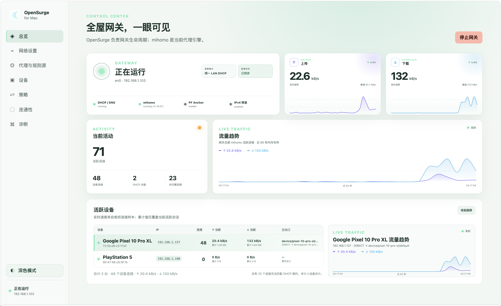

# OpenSurge for Mac App 使用指南

**简体中文** · [English](app-user-guide.md)

本指南面向通过安装包使用 OpenSurge for Mac 的普通用户，介绍从安装、准备代理配置到启动
网关和安全恢复网络的基本流程。CLI、开发构建和高级配置不在本文展开。

本页的桌面操作描述对应 v0.3.0 及之后的版本；v0.2.4 使用旧 Swift 菜单栏宿主。
安装器的已验证范围与待完成平台验收见[桌面安装验收](../agent-wiki/sources/validation/evidence-map.md#桌面与安装)。

## 安装与打开

1. 打开 [GitHub Releases](https://github.com/YTwsy/OpenSurge-for-Mac/releases)
   中的最新稳定版，展开页面底部的 **Assets**，下载匹配芯片的 `.pkg`：
   Apple Silicon 选择 `arm64`，Intel Mac 选择 `x86_64`。v0.2.4 的旧菜单栏操作请参照[对应版本指南](https://github.com/YTwsy/OpenSurge-for-Mac/blob/v0.2.4/docs/app-user-guide.zh-CN.md)。
2. 双击安装包。如果 macOS 阻止打开，请前往**系统设置 → 隐私与安全性**，对这个安装包
   选择**仍要打开**。不需要全局关闭 Gatekeeper。
3. 安装完成后，从 `/Applications` 打开 **OpenSurge**，进入独立主窗口。
4. 之后点击 Dock、再次打开 App 或选择菜单栏的**打开 OpenSurge 面板**，都会恢复同一个
   主窗口。菜单栏图标展开独立的状态面板，订阅、网络、设备和策略操作在主窗口完成。

首次打开默认约 1440 × 900 个逻辑像素，会适配当前屏幕的可用区域。用户可以手动缩放，
下次打开会记住所选尺寸。顶部空白区域可拖动；原生红黄绿按钮与侧栏融合。关闭窗口只会
隐藏，`⌘Q` 会确认只退出桌面 App，后台服务与运行中的网关继续工作。

菜单栏的 **App 设置与更新**可显式启用登录项；需要系统批准时，按提示进入登录项设置。
升级不会自动开关登录项，以 macOS 返回的状态为准。

菜单栏状态面板会自动检查一次最新稳定版，也可以点击**检查更新**手动刷新。发现新版本
后，选择**打开下载页**会进入该版本的 GitHub Release；App 不会自行下载或安装 PKG，
仍按上面的安装步骤选择对应架构的安装包。升级不需要先卸载，现有配置和数据会保留。
预发行构建会显示完整的 `rc.N` 版本：不会提示降级到更旧的稳定版，但同基础版本的正式版
发布后会显示更新。

## 首次使用

### 1. 准备代理配置

导入 mihomo YAML 是可选的数据来源，而不是使用 OpenSurge 的前置条件。首次使用可以任选
一种方式，也可以把两者组合起来：

- 进入**来源**，导入 HTTPS 订阅地址或本地 mihomo YAML 文件。本地文件既可以点击
  **选择或拖入 YAML**后选择，也可以直接拖到同一区域；这是页面中完整 YAML 来源的
  导入入口。点击**导入为草稿**并确认结构校验通过；网关尚未运行时，可以点击
  **设为下次启动版本**，运行时则可以选择**应用并重载网关**。
- 展开来源列表之后默认折叠的**高级：全局附加配置**。即使没有导入任何来源，也可以只用
  一份有效的全局附加配置添加自己的节点、Provider、策略组、规则和 DNS 操作。OpenSurge
  会为这种独立用法补齐托管基础配置，使它可以进入与导入来源相同的预览和启动流程。

普通附加配置编辑提供两项常用操作：固定在其他规则之前的高优先级自定义规则，以及通过
`ss://`、`vmess://`、`vless://`、`trojan://`、`hysteria2://`、HTTP 或 SOCKS5
分享链接添加的自定义节点；HTTP/SOCKS5 也保留简易手工表单。这里的分享链接只会增加一个
节点，不会新建订阅或完整 YAML 来源。低优先级尾部规则、Provider、策略组和 DNS 操作在
**专家 Overlay YAML**中维护。

保存来源或全局附加配置草稿不会立即改变当前网络。最终配置会按当前实际存在的输入统一
合成：选定的来源、全局附加配置，以及已启用时由 OpenSurge 托管的 Tailscale Exit Node。
缺少其中任意一项都是正常状态；例如没有来源、没有 Tailscale、只有有效全局附加配置时，
仍然可以完整使用。

网关停止时，进入**策略**即可查看这份最终合成配置中的策略组和节点、选择手动策略组成员，
并检测节点延迟。这个页面使用不接管网络的准备态 mihomo 提供真实的 Provider 展开、选择和
测速能力。访问**策略**不是启动前置：即使没有打开过该页面，也可以直接在 Web GUI 点击
**启动 OpenSurge**；启动流程会合成同一份配置，完成最终校验后保存并启动。
预览、选择和测速不会改写已保存的启动配置。运行中保存附加配置草稿不改变实际出口；
仅附加配置的草稿在下次 App 启动时采用。运维命令 `sudo omg start` 则只使用已持久化配置，
不读取 Web 草稿。
如果需要检查具体变化，也可以在来源页通过**最终配置预览**比较原始来源、附加变化、有效
来源与最终 mihomo 配置。订阅刷新只生成新草稿，不会自动改变正在运行的网关。

每张已导入来源卡片都会显示 OpenSurge 管理的本地快照位置。可以复制完整路径，或点击
**Finder 中显示**直接选中该快照；管理快照用于摘要、历史与后续应用，请勿直接编辑。
需要修改时点击**导出副本**：OpenSurge 会在
`~/Library/Application Support/OpenSurge/exports/` 创建权限为 `0600` 的独立 YAML，
然后立即打开 Finder 并选中新文件。导出的副本不会被来源刷新覆盖，也不会自动成为新的
草稿；修改后可按本地文件重新导入。

### 2. 选择网络模式

进入**网络设置**，根据使用场景选择模式：

| 模式 | 适合场景 | 主要操作 |
| --- | --- | --- |
| 局域网 DHCP 接管 | 让同一家庭 LAN 的设备自动使用 OpenSurge | 需要按流程关闭和恢复路由器 DHCP |
| 旁路由模式 | 先让少量设备试用 | 路由器 DHCP 保持开启，设备手工把网关和 DNS 指向 Mac |
| 独立下游 LAN | 独立 AP、SSID 或 VLAN | Mac 为独立下游网络提供网关服务 |

首次安装后选择**旁路由模式**或**局域网 DHCP 接管**时，OpenSurge 会读取当前主网络，
把接口、Mac 当前 IPv4 和当前子网前缀填入尚未保存的配置草稿；DHCP 接管还会在当前网段中生成一个
避开 Mac、路由器和受保护地址的建议地址池，并填入当前主路由网关与 DNS，供之后
选择**直连主路由**的设备使用。自动填写不会保存配置，也不会修改 macOS
网络。**独立下游 LAN**保持手工配置，避免把上游地址误用到独立子网。

确认下游接口、上游接口、Mac 网关 IPv4 和 DHCP 地址池。上游 DNS、透明代理模式与
fake-IP 映射持久化位于默认折叠的**高级 Mihomo / DNS 设置**；透明代理建议保持
**mihomo TUN**，fake-IP 映射持久化建议保持开启，以免 apply/restart 后 cloudflared 等
长驻进程继续使用已经失效的 fake-IP。**每设备策略默认开启**；需要为不同设备设置出口时，
直接前往“设备”页登记和配置，无需在网络设置中启用开关。
完成后点击**保存网络配置**。

三个拓扑都可以使用两个实验性 IPv6 设置：**IPv6 DNS 查询**决定是否回答 AAAA，
**下游 IPv6 接管**决定是否建立 TCP/UDP 用户态数据面。`自动` 只在上游有公网 IPv6
地址（ULA 不算）和 IPv6 默认路由时接管；`总是启用` 可在没有原生 IPv6 时建立下游
路径，但真实公网 IPv6 `DIRECT` 仍需要上游路由。

独立下游 LAN 会自动发布 RA/SLAAC/RDNSS。局域网 DHCP 接管也会向全 LAN 自动发布，
但必须先关闭主路由 IPv6 RA/DHCPv6，或使用 RA Guard，页面确认后才能保存。OpenSurge
使用通常的 Medium 路由器优先级。旁路由模式不发布 RA；页面的“旁路由设备填写速查”
会列出设备 IPv4、IPv6 ULA，以及同一个 Mac link-local 默认网关和 DNS。只在选定设备上照填，
并移除该设备原有的主路由 IPv6 默认路由。

旁路由模式登记设备时只需填写固定 IPv4，MAC 是可选身份信息。若以后切换到 DHCP
模式，OpenSurge 会先让你确认当前能够观察到的 MAC；仍无法取得 MAC 的设备资料和规则会
保留，但专属策略暂停，补充 MAC 后恢复。已有设备全都登记了 MAC 时不会出现迁移提示。

如果 SafeDNS、DNS Proxy、内容过滤或其他 Network Extension 让 Mac 本机在只开 TUN 时
出现 DNS/访问异常，可以在同一表单启用**Mac 本机系统代理协同**。OpenSurge 会在网关
启动后把当前上游网络服务的 HTTP/HTTPS 系统代理指向本机 mihomo mixed-port，并在停止、
启动回滚或 mihomo 重启失败时恢复启动前状态。这个开关默认关闭，只适用于 TUN 模式和
遵循系统代理的 Mac 应用；它不替代 TUN，也不改变下游设备。已有 HTTP/HTTPS 代理、PAC
或自动代理发现时，OpenSurge 会拒绝启动，避免覆盖现有设置。

更完整的拓扑说明见[使用方式与结构图](usage-topologies.zh-CN.md)。

### 3. 启动 OpenSurge

使用**局域网 DHCP 接管**时，启停操作位于网络恢复状态机中。请依次完成：

1. 保存网络快照与离线恢复卡。
2. 将 Mac 切换为固定 IPv4。
3. 按页面提示关闭路由器 DHCP。
4. 返回 OpenSurge，执行 DHCP OFFER 探测。
5. 探测通过后，点击**启动 OpenSurge**。
6. 让客户端重新连接网络，并在页面中完成 DHCP、DNS 与 TUN 验收。

不要在关闭路由器 DHCP 后跳过页面直接退出。OpenSurge 会保留恢复状态，直到网络恢复流程
真正完成。

如果 Mac 已经使用固定 IPv4，但你决定不再继续接管，可以点击**放弃 DHCP 接管**。
OpenSurge 会先探测当前网络是否已有 DHCP server：若已恢复，就把 Mac 切回自动 DHCP
并结束流程；若仍没有 DHCP OFFER，则保留 Mac 的固定 IPv4 并以“保留静态 IP”结束，
不会声称路由器 DHCP 或其他设备的自动获取能力已经恢复。两种结果都会解除恢复锁定；
网关停止后，菜单栏中的**退出 OpenSurge**会重新可用。

## 日常使用

- **总览**：查看网关状态、当前配置、活跃设备和最近 60 秒流量趋势。
- **来源**：刷新订阅并查看新旧版本差异。刷新只生成草稿，需要再次应用。
- **设备**：切换 Mac 本机的规则 / 全局 / 直连，并为下游设备选择跟随网关规则、
  独立设备出口，或在 DHCP 接管中选择 IPv4 直连主路由。这些控制互不影响；最后一种
  模式会在下游 IPv6 开启时阻止该设备的 IPv6 出站，但设备仍可能保留 SLAAC/RDNSS。
- **策略**：网关停止时查看最终合成的策略、选择手动策略组成员并检测节点延迟；网关运行时
  管理实际应用的 Selector，切换会即时生效。
- **连通性**：检查当前 applied 配置与 Mac 本机模式访问真实服务时的延迟、命中规则
  和出口链；它不代表下游设备路径。
- **连接**：按本机或下游设备查看活跃连接、目标、命中规则、实际出口链和上下行速率。
  支持搜索、IPv4/IPv6 与协议筛选、排序、分页和暂停画面；总览及设备页提供快捷入口。
- **诊断**：查看近期操作、Provider 和脱敏日志。

连接页保留已登记但当前没有流量的设备，并区分“有 DHCP 租约”“登记尚未应用”和
“流量已观察”。没有活跃连接不代表设备离线；IPv4 直连主路由的流量不在观察范围内。
设备身份可确认时，IPv4 与下游 IPv6 会话合并到同一设备；无法确认的来源单独显示。
这些数据只覆盖当前活跃会话，暂停画面不会暂停网络。请求失败时会标注上次采样，
避免把旧画面当成实时状态。

菜单栏面板和 Web GUI 侧栏都提供**合盖保持运行**。它默认关闭，只对当前 OpenSurge
运行有效，并且不依赖网关状态；打开后会阻止空闲和合盖睡眠。选择**退出 OpenSurge**或
重启 Mac 后会自动释放。合盖运行会增加耗电与发热，请勿把仍在运行的 Mac 放入不通风的
包内。

设备页中的 Mac 本机模式只影响经 TUN 或本机显式代理进入 OpenSurge 的新连接；它本身
不会修改 macOS 系统代理，也不会改变下游设备。系统代理只由网络设置中的独立兼容开关
管理。绿色**即时生效**操作只切换已经应用的出口；
修改设备身份、候选或规则后，需要先保存，再按提示重载网关。详细边界见
[Mac 本机流量模式](local-mac-routing.zh-CN.md)。

节点健康和连通性检测由网关 Mac 发起。它们可以帮助判断代理配置是否工作，但不能代替
某台下游设备的 DHCP、DNS 和 TUN 验收。

## 停止与恢复网络

使用**局域网 DHCP 接管**时，停止网关也是恢复状态机的一部分：

1. 完成客户端验收，或明确选择跳过验收。
2. 点击**停止 OpenSurge**。
3. 按页面提示重新开启路由器 DHCP。
4. 返回 OpenSurge，执行 DHCP OFFER 探测。
5. 将 Mac 恢复为自动 DHCP，或明确选择保留静态 IPv4。
6. 确认恢复流程已经完成后，再退出 OpenSurge。

菜单栏中的两个退出入口含义不同：

- **只退出桌面 App**：关闭主窗口和菜单栏图标，不停止网关和后台服务。
- **退出 OpenSurge**：仅在网关已经停止且没有待处理恢复时可用，同时退出桌面 App 和
  用户级 Control Service。

## 卸载

在菜单栏状态面板底部选择**卸载 OpenSurge…**。只要网关状态为**已停止**就可以继续；
DHCP 接管恢复提示和系统原本已经开启的 IPv4 forwarding 不会阻止卸载，也不会被卸载器
擅自修改。

确认窗口提供两个选择：

- **保留数据并卸载**：移除 OpenSurge App、Control Service 和 root Helper，保留配置、
  订阅凭据与策略数据，方便以后重新安装。
- **彻底卸载**：同时删除配置、订阅凭据、运行记录和日志。

macOS 会显示管理员授权窗口。如果网关仍在运行，卸载入口不可用；请先进入
**网络设置**停止网关，再返回菜单栏执行卸载。升级新版本不需要先卸载，直接运行新版
安装包即可保留现有数据。

## 常见问题

**Web GUI 无法打开**

在菜单栏中点击**重新连接**。这个操作只重启用户级 Control Service，不会停止正在运行的
网关数据面。

**无法继续启动流程**

查看网络设置页显示的 blocker，确认接口、Mac 网关 IPv4、受保护地址和 DHCP 地址池没有
冲突，并确认所有修改已经保存。如果实际启动报告 TUN 路由冲突，请根据错误中的接口/
网关信息关闭对应客户端的 Exit Node 或全局 TUN 模式，再重试启动。

**设备没有显示流量**

先让设备产生新的网络访问，再刷新总览。页面展示的是当前活跃会话和最近 60 秒趋势，不是
长期流量历史。

**一直显示网络恢复尚未完成**

进入**网络设置**继续恢复状态机。网关停止并不等于路由器 DHCP 和 Mac 网络设置已经恢复。
